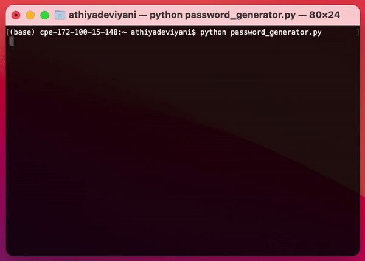

# Password-Generator
Safe passwords made easy: a Python script that generates memorable passwords using words from the NLTK Brown corpus of 1,161,192 English words.

## Features
- Choice of 1, 2, 3, or 4 words in the password (length will always be >= 8 characters)
- Choice of using capital letters (recommended)
- Choice of using numbers (recommended)
- Choice of using c00lc4s3 or standard99 for passwords with 1 word and numbers (funky, recommended)
- Choice of using symbols (recommended)
- Copies to clipboard automatically when password is selected!

## Preview
4 words with capital letters, numbers, and symbols<br>

<br>

1 word with a capital letter, numbers, and symbols in c00lc4s3<br>


## Try it yourself
```
$ git clone https://github.com/athiyadeviyani/Password-Generator.git
$ cd password-generator
$ pip install -r req.txt
$ python password-generator.py
```
Don't forget to ⭐️ this repo if you like it!
